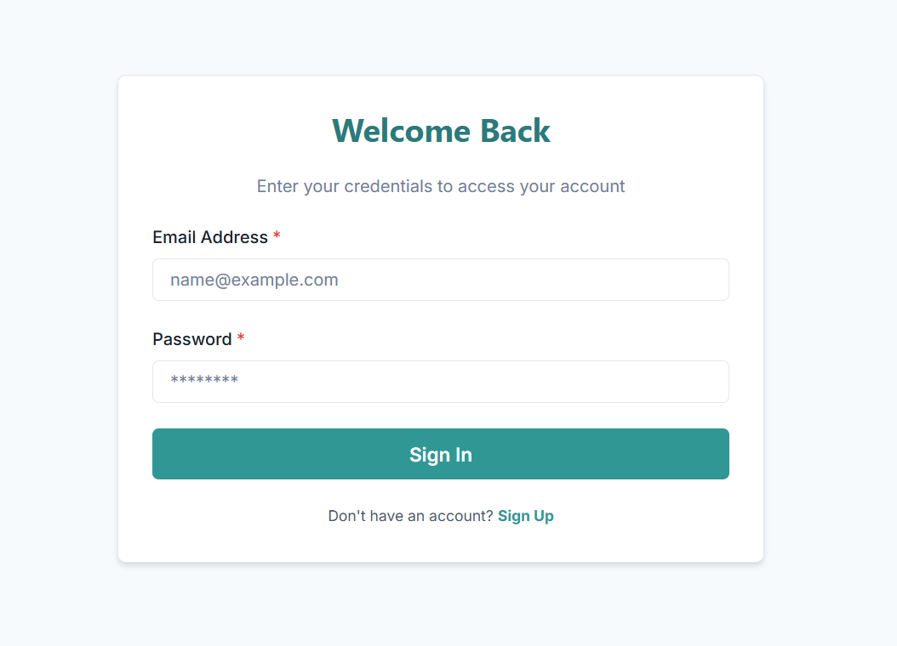
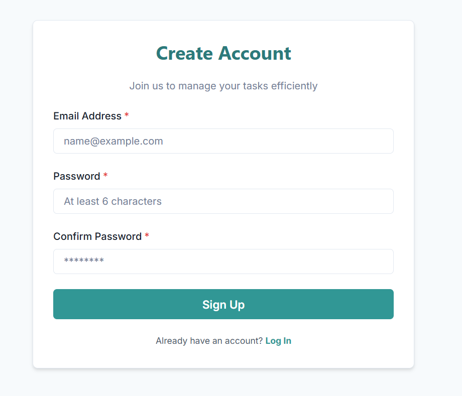
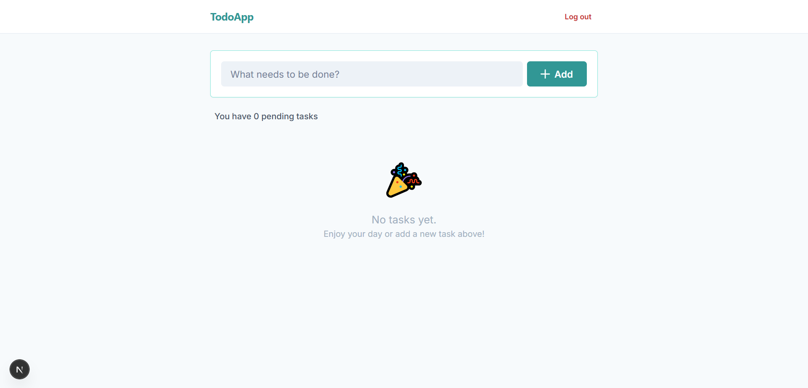

# 🚀 Full Stack Sticky Wall (FastAPI & Next.js)

A modern, secure, and production-ready Sticky Notes / To-Do application built with **FastAPI (Python)** and **Next.js (TypeScript)**.

This app allows users to create, manage, and organize tasks with categories, priority levels, due dates, and a modern sticky-wall UI.

🌐 **Live Demo:**  
Frontend (Vercel): https://dotodo-app.vercel.app/

---

# ✨ Features

## 📝 Task Management
- Create sticky note tasks
- Edit tasks anytime
- Delete tasks with confirmation modal
- Mark tasks as completed
- Modern sticky-wall visual layout

## 🚦 Priority System
Each task can have a priority level:

- 🟢 Low
- 🟡 Medium
- 🔴 High

Priority is visible directly on the sticky card.

---

## 📂 Category Management
Full category lifecycle support:

- Create category
- Rename category
- Delete category
- Automatic fallback to **Uncategorized** when category is deleted
- Each task displays its category clearly

---

## 📅 Due Date & Countdown
Tasks support due dates with smart indicators:

- Select due date when creating or editing task
- Automatically shows:

Examples:

- `Today`
- `3 days left`
- `Overdue 2d`

This helps users track deadlines easily.

---

## ✏️ Edit Tasks After Creation

Users can edit:

- Title
- Priority
- Category
- Due date

Using a modern edit modal.

---

## 🔔 Toast Notification System

Beautiful toast alerts for:

- Task created
- Task updated
- Task deleted
- Errors

Improves UX and feedback.

---

## 🔐 Authentication

Secure Firebase authentication:

- Register
- Login
- Logout
- Token-based backend protection

Each user only sees their own tasks and categories.

---

# 🛠️ Tech Stack

## Backend

- FastAPI (Python 3.10)
- SQLModel (SQLAlchemy)
- PostgreSQL (Render hosted)
- Firebase Admin SDK
- Pydantic
- Docker

## Frontend

- Next.js 14 (App Router)
- TypeScript
- TailwindCSS
- Axios
- Firebase Client SDK
- DnD-kit (Drag UI only)
- Modern custom UI components

---

# 🖼️ Screenshots

| Login | Register |
|------|---------|
|  |  |

| Sticky Wall |
|------------|
|  |

---

# 🧠 Architecture Overview

Frontend (Next.js, Vercel)
⬇  
REST API  
⬇  
Backend (FastAPI, Render)  
⬇  
PostgreSQL Database (Render)

Authentication handled via Firebase.

---

# 🚀 Getting Started (Local Development)

## Requirements

- Node.js 18+
- Python 3.10+
- PostgreSQL
- Firebase Project

---

## 1. Clone repository

```bash
git clone https://github.com/yasinciftcii/todo-app-fastapi.git
cd todo-app-fastapi
```bash

## 2. Environment Setup ⚙️

```bash
Since this project handles sensitive data, we use environment variables. You need to configure them before running the app.

**Backend Setup:**
1.  Navigate to the `backend/` folder.
2.  Create a copy of the example file:
    * Copy content from `backend/.env.example` to a new file named `.env`.
3.  Open `backend/.env` and fill in your database credentials.
4.  Place your Firebase Admin JSON file inside the `backend/` folder and rename it to:
    * `firebase-service-account.json`

**Frontend Setup:**
1.  Navigate to the `frontend/` folder.
2.  Create a copy of the example file:
    * Copy content from `frontend/.env.local.example` to a new file named `.env.local`.
3.  Open `frontend/.env.local` and paste your Firebase Client keys (API Key, Auth Domain, etc.) from the Firebase Console.
4.  Set the API URL:
    ```bash
    NEXT_PUBLIC_API_URL=http://localhost:8000
    ```
```bash

### 3. Run with Docker 🐳

```bash
The easiest way to run the app is using Docker Compose. This will set up the database, backend, and frontend containers automatically.

```bash
docker-compose up -d --build
```bash