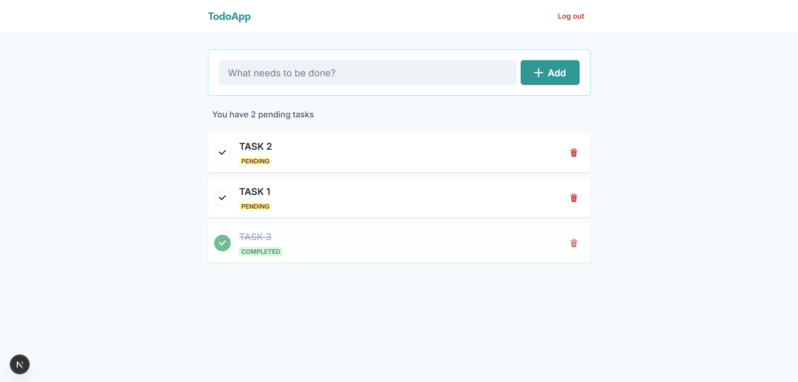

# 🚀 Full Stack To-Do App (FastAPI & Next.js)

A modern, secure, and containerized To-Do application built with **FastAPI (Python)** and **Next.js (TypeScript)**. It features real-time updates, Firebase authentication, and a robust PostgreSQL database.


## 🛠️ Tech Stack

### Backend
* **Framework:** FastAPI (Python 3.10)
* **Database:** PostgreSQL 15 (Managed via SQLModel/SQLAlchemy)
* **Authentication:** Firebase Admin SDK
* **Testing:** Pytest & Httpx (In-Memory SQLite testing)
* **Containerization:** Docker & Docker Compose

### Frontend
* **Framework:** Next.js 14 (App Router)
* **Language:** TypeScript
* **Styling:** Chakra UI
* **State Management:** Zustand
* **HTTP Client:** Axios

---

## 🖼️ Gallery

| Login Page | Register Page |
|:---:|:---:|
|  |  |

| Tasks Management |
|:---:|
|  |

---

## 🚀 Getting Started

Follow these instructions to get the project up and running on your local machine.

### Prerequisites
* Docker & Docker Compose
* Node.js (Optional, if running frontend locally without Docker)
* A Firebase Project (for authentication)

### 1. Clone the Repository
```bash
git clone https://github.com/yasinciftcii/todo-app-fastapi.git
cd todo-app-fastapi
```

### 2. Environment Setup ⚙️

Since this project handles sensitive data, we use environment variables. You need to configure them before running the app.

**Backend Setup:**
1.  Navigate to the `backend/` folder.
2.  Create a copy of the example file:
    * Copy content from `backend/.env.example` to a new file named `.env`.
3.  Open `backend/.env` and fill in your database credentials.
4.  Place your Firebase Admin JSON file inside the `backend/` folder and rename it to:
    * `firebase-service-account.json`

**Frontend Setup:**
1.  Navigate to the `frontend/` folder.
2.  Create a copy of the example file:
    * Copy content from `frontend/.env.local.example` to a new file named `.env.local`.
3.  Open `frontend/.env.local` and paste your Firebase Client keys (API Key, Auth Domain, etc.) from the Firebase Console.

### 3. Run with Docker 🐳

The easiest way to run the app is using Docker Compose. This will set up the database, backend, and frontend containers automatically.

```bash
docker-compose up -d --build
```

Once the containers are running, you can access the application:

* **Frontend (App):** [http://localhost:3000](http://localhost:3000)
* **Backend (API Docs):** [http://localhost:8000/docs](http://localhost:8000/docs)

---

## 🧪 Running Tests

Unit tests are written using `pytest`. They run in an isolated environment using an in-memory SQLite database, ensuring no data corruption in your main database.

```bash
# Run tests inside the running Docker container
docker exec todo_backend pytest
```

---

## 🔒 Security Features

* **Environment Variables:** Sensitive keys are strictly separated from the code using `.env` files (not committed to Git).
* **CORS Protection:** Configured to restrict unauthorized domain access.
* **Auth Middleware:** Custom FastAPI dependency to verify Firebase tokens on protected endpoints.
* **SQL Injection Protection:** Usage of ORM (SQLModel) prevents raw SQL vulnerabilities.
* **Container Isolation:** Database runs in a separate container, not exposed to the public internet.

## 📂 Project Structure

```bash
├── backend/             # FastAPI Application
│   ├── main.py          # Entry point
│   ├── models.py        # Database models
│   ├── auth.py          # Firebase Auth logic
│   └── tests/           # Unit tests
├── frontend/            # Next.js Application
│   ├── app/             # App Router pages
│   ├── components/      # Reusable UI components
│   └── lib/             # API and Firebase config
├── docker-compose.yml   # Docker orchestration
└── README.md            # Project documentation
```